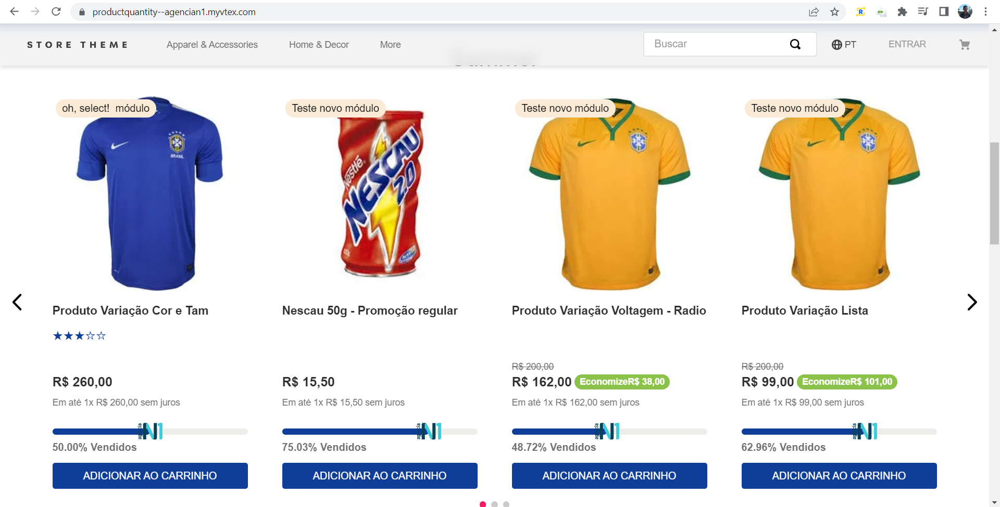

# Product Quantity Progress Bar

<!-- DOCS-IGNORE:start -->
<!-- ALL-CONTRIBUTORS-BADGE:START - Do not remove or modify this section -->

<!-- ALL-CONTRIBUTORS-BADGE:END -->
<!-- DOCS-IGNORE:end -->

O componente React personalizado é uma calculadora intuitiva e eficiente projetada especificamente para lojas que utilizam a plataforma VTEX. Com essa ferramenta poderosa, você poderá facilmente obter insights valiosos sobre as vendas de seus produtos em relação à quantidade atual e original.

Ao integrar este componente à sua loja VTEX, você será capaz de acompanhar o desempenho das vendas de forma clara e concisa. A calculadora de porcentagem de vendas permite que você visualize instantaneamente a diferença entre a quantidade atual de um produto e sua quantidade original, fornecendo uma métrica essencial para análise de desempenho.

O componente React é altamente personalizável e se integra perfeitamente à sua loja VTEX existente. Você pode configurar facilmente o design e o estilo para atender às necessidades de sua marca, garantindo uma experiência perfeita e coerente com o restante do seu site.

Além disso, com a flexibilidade do React, você pode estender e adaptar o componente de acordo com os requisitos específicos de sua loja. A integração é simples, e fornecemos uma documentação abrangente e um suporte dedicado para garantir que você aproveite ao máximo essa poderosa ferramenta.

Observação: O componente está estilizado.

## Configurações 

* product-quantity-component

1. Crie uma tabela no master data com o Acrônimo `QP` e nome Quantidade dos Produtos, além disso criar os campos listados na tabela abaixo.
2. Adicionando o aplicativo como uma dependência de tema no arquivo manifest.json;
3. Declarar o "product-quantity-component" nas prateleiras que deseja.

### Campos da tabela

| Camp         | Type            | Description                                                                                                             | Display Name    |
| ------------ | --------------- | ----------------------------------------------------------------------------------------------------------------------- | --------------- | 
| `active`     | `boolean`       | Responsavel por ativar a quantidade de produtos.                                                                       | `Ativar?`     |
| `productId`   | `Varchar 100`   | O id do produto que vai receber a barra de progresso.     | `Id do Produto`       |
| `productQuantity`  | `Varchar 100`   | Colocar a quantidade de produtos inicial.                                                                      | `Quantidade do Produto`    |

### Props para alterar no arquivo json

| Camp |  Description | Type |
| ---- |  ----------- | ---- |
| text | Se caso ativar a porcentagem o dev deve tem liberdade em adicionar um texto, por exemplo "Vendidos". | String |
| srcImage | Colocar a URL de uma image que vai ficar no final da barra de progressão. | String |
| activeImage | Para ativar imagem. | Boolean |
| sensoPercentagem | Se verdadeiro a barra vai representar quantos produtos foram vendidos se falso quantos faltam para acabar. | Boolean |
| activePercentageValue | Ativar a porcentagem. | Boolean |

## Descrições

* product-quantity-component:

Apresentamos com entusiasmo nosso novo componente exclusivo: a barra de progresso personalizável para representar a quantidade de produtos vendidos! Com este recurso avançado, você terá total controle sobre a aparência e a funcionalidade da barra, permitindo que você a adapte perfeitamente ao seu projeto.

Através desta solução inovadora, você poderá exibir visualmente a porcentagem de produtos vendidos de forma clara e intuitiva. Seja em um site de comércio eletrônico, um aplicativo móvel ou qualquer outra plataforma, nossa barra de progresso facilmente editável se adapta às suas necessidades específicas.

Com apenas alguns ajustes simples, você poderá personalizar a barra de progresso de acordo com o estilo visual do seu projeto, escolhendo as cores, os ícones e até mesmo os efeitos de animação que desejar. Além disso, nossa solução permite que você atualize facilmente a porcentagem de produtos vendidos, mantendo seus usuários informados sobre o progresso das vendas.

## Customização

`Para aplicar personalizações de CSS neste e em outros blocos, siga as instruções fornecidas na receita em [Usando CSS Handles para personalização da loja](https://vtex.io/docs/recipes/style/using-css-handles-for -store-personalização).`

As classes do componente product-quantity-component que permitem customização estão listadas na tabela abaixo: 

| CSS Handles |  description |
| ----------- |  ----------- | 
| `body__bar` | Corpo principal da barra de progressão. |
| `percentage__value` | Para alterar a o texto de porcentagem. |
| `container__bar` | Container que contém a barra de progresso. |
| `bar__color` | Para alterar a barra principal de progressão. |
| `img__bar` | Caso tenha imagem, class para alterar. |
